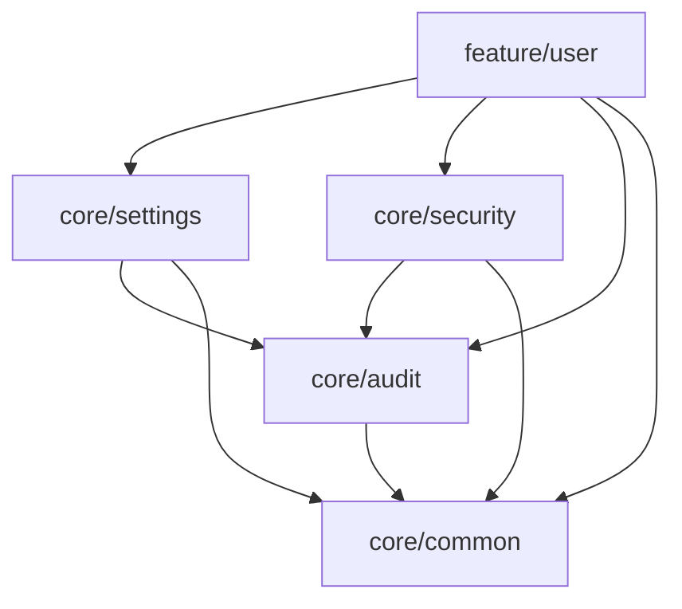
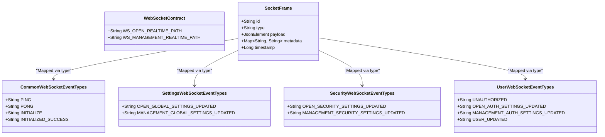
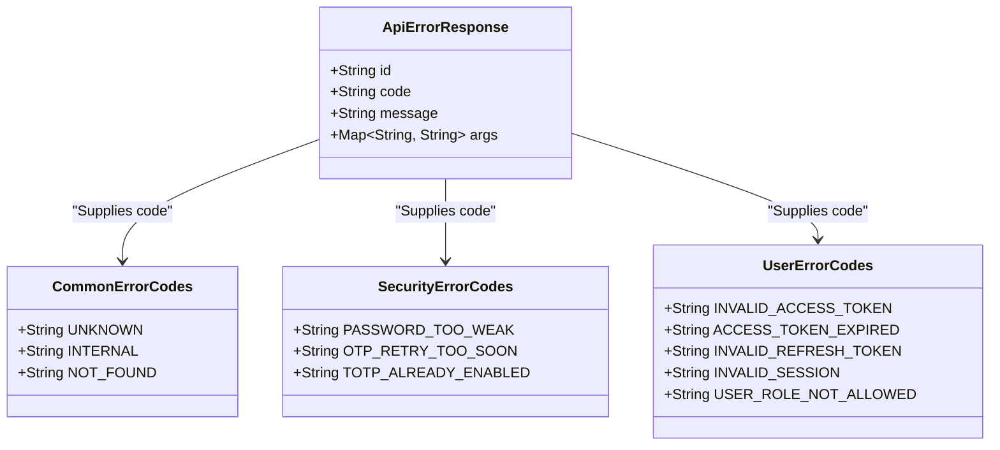

# shared-foundation Architecture

This document provides a visual representation of the static structure, taxonomy of contracts, and module dependencies within the `shared-foundation` project. As a KMP library containing shared wire types (DTOs, constants, error codes, and routes), it does not include execution flows or engine wiring.

## 1. Module Dependency Graph

The following graph illustrates the static dependencies between the library modules, demonstrating the direction from `feature/*` to `core/*`.

## 2. Surface Separation: Open vs Management

This flowchart visualizes the architectural separation between unprivileged (Open) and protected (Management) API surfaces. It maps management routes to their corresponding, strongly-typed permission codes.

```mermaid
flowchart TB
    subgraph APISurfaces ["API Surfaces"]
        OpenAPI["Open API (Public / Unprivileged)"]
        ManagementAPI["Management API (Protected / Admin)"]
    end

    subgraph OpenRoutes ["Open Routes"]
        OpenGlobalSettingsRoutes["OpenGlobalSettingsRoutes"]
        OpenSecuritySettingsRoutes["OpenSecuritySettingsRoutes"]
        OpenUserRoutes["OpenUserRoutes"]
        OpenSessionRoutes["OpenSessionRoutes"]
        OpenUnlockRoutes["OpenUnlockRoutes"]
        OpenIdentifierRoutes["OpenIdentifierRoutes"]
        OpenAuthSettingsRoutes["OpenAuthSettingsRoutes"]
    end

    subgraph ManagementRoutes ["Management Routes"]
        ManagementGlobalSettingsRoutes["ManagementGlobalSettingsRoutes"]
        ManagementSecuritySettingsRoutes["ManagementSecuritySettingsRoutes"]
        ManagementAuditRoutes["ManagementAuditRoutes"]
        ManagementUserRoutes["ManagementUserRoutes"]
        ManagementSessionRoutes["ManagementSessionRoutes"]
        SelfManagementRoutes["SelfManagement Routes"]
    end

    subgraph PermissionCodes ["Permission Codes"]
        SettingsPermissionCode["SettingsPermissionCode"]
        SecurityPermissionCode["SecurityPermissionCode"]
        AuditPermissionCode["AuditPermissionCode"]
        PermissionCode["PermissionCode (Base Inline Class)"]
    end

    OpenAPI --> OpenRoutes
    ManagementAPI --> ManagementRoutes

    OpenRoutes -.-> OpenGlobalSettingsRoutes
    OpenRoutes -.-> OpenSecuritySettingsRoutes
    OpenRoutes -.-> OpenUserRoutes
    OpenRoutes -.-> OpenSessionRoutes
    OpenRoutes -.-> OpenUnlockRoutes
    OpenRoutes -.-> OpenIdentifierRoutes
    OpenRoutes -.-> OpenAuthSettingsRoutes

    ManagementRoutes -.-> ManagementGlobalSettingsRoutes
    ManagementRoutes -.-> ManagementSecuritySettingsRoutes
    ManagementRoutes -.-> ManagementAuditRoutes
    ManagementRoutes -.-> ManagementUserRoutes
    ManagementRoutes -.-> ManagementSessionRoutes
    ManagementRoutes -.-> SelfManagementRoutes

    ManagementGlobalSettingsRoutes -->|Enforced By| SettingsPermissionCode
    ManagementSecuritySettingsRoutes -->|Enforced By| SecurityPermissionCode
    ManagementAuditRoutes -->|Enforced By| AuditPermissionCode
    
    SettingsPermissionCode -->|Wraps| PermissionCode
    SecurityPermissionCode -->|Wraps| PermissionCode
    AuditPermissionCode -->|Wraps| PermissionCode
```

## 3. WebSocket Wire Contract

This diagram details the real-time communication envelope (`SocketFrame`) and categorizes the different feature event types flowing through the connection (`WebSocketContract`).

## 4. Taxonomy of Error Handling

This class diagram illustrates the unified shape of HTTP error bodies (`ApiErrorResponse`) alongside the categorized registry of standard and module-specific error codes.

